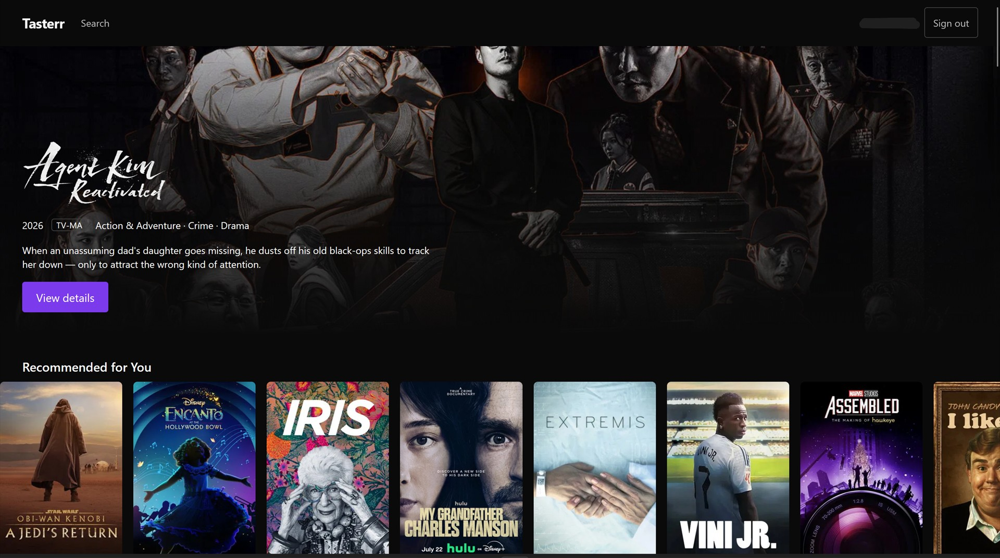
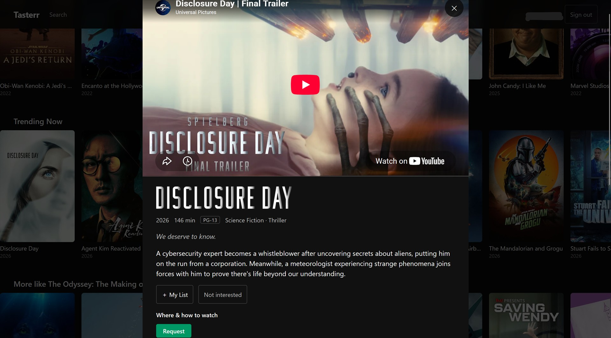
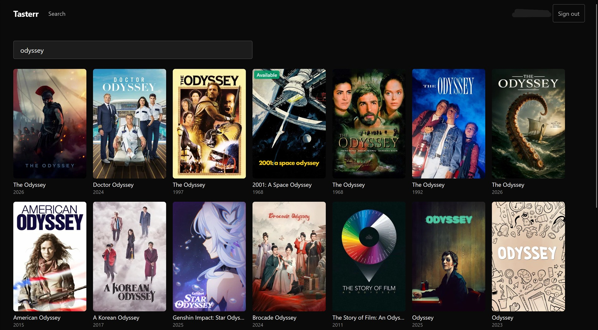

<p align="center">
  
</p>

<h1 align="center">Tasterr</h1>

<p align="center">Self-hosted discovery for TMDB and Seerr, with a learned taste profile for every household member.</p>

<p align="center">
  <a href="https://github.com/ZacharyArthur/tasterr/actions/workflows/gate.yml"></a>
  <a href="https://github.com/ZacharyArthur/tasterr/releases"></a>
  <a href="https://github.com/users/ZacharyArthur/packages/container/package/tasterr"></a>
  <a href="LICENSE"></a>
</p>

Tasterr is a self-hosted, Netflix-style discovery front end for a household media
stack. It combines the TMDB catalog with Seerr identity, library state, and requests,
then learns a separate taste profile for each signed-in user.

Version 1.0 supports Plex or local Seerr sign-in, composed discovery rails, search,
title details, availability badges, requests attributed to the signed-in member,
per-user taste signals and recommendations, and admin-managed regions, services,
rails, and appearance. It intentionally does not bundle Seerr, play media, import
Plex history, or run more than one Tasterr process.

## Screenshots

<a href="docs/screenshots/home.jpg">
  
</a>

<p align="center">
  <a href="docs/screenshots/detail.jpg"></a>
  <a href="docs/screenshots/search.jpg"></a>
</p>

## Quick start with an existing Seerr

Prerequisites are Docker with Compose, a running Seerr instance, a TMDB v3 API key,
and a Seerr API key. A shared Docker network is not required when Seerr is reachable
through a routable LAN hostname or address.

1. Copy `.env.example` to `.env`.
2. Set `SEERR_INTERNAL_URL` to a URL reachable from inside the Tasterr container,
   such as `http://seerr.home.arpa:5055`. Set `SEERR_EXTERNAL_URL` to the URL
   household browsers use for Seerr.
3. Fill `TMDB_API_KEY`, `SEERR_API_KEY`, and a randomly
   generated `TASTERR_SECRET_KEY`.
4. Start and verify Tasterr:

   ```console
   docker compose up -d --build
   docker compose ps
   curl --fail http://127.0.0.1:8000/api/v1/health
   ```

Open `http://127.0.0.1:8000`, sign in with an existing Seerr account, and use the
Settings screen as a Seerr administrator to select the region, streaming services,
rails, theme, and accent. SQLite migrations run automatically on first boot.

Compose publishes Tasterr on host loopback by default. For intentional direct LAN
access, set `TASTERR_HTTP_PORT=8000` (or a specific LAN IP and port) in `.env` and
keep the host firewall closed to the public internet. Internet-facing deployments
must use a TLS reverse proxy or tunnel; see the configuration guide.

When Seerr runs on this same Docker host in another Compose project, an optional
external-network override is available; see the configuration guide. It is not used
for Seerr on another host.

### Run the published image

To deploy a release without cloning the repository, save this as `compose.yaml`
and create `.env` from [`.env.example`](.env.example), using the five configuration
values listed above. Pin the desired version from the
[Tasterr GHCR package](https://github.com/users/ZacharyArthur/packages/container/package/tasterr):

```yaml
services:
  tasterr:
    image: ghcr.io/zacharyarthur/tasterr:1.0.2
    restart: unless-stopped
    ports:
      - "127.0.0.1:8000:8000"
    env_file:
      - .env
    volumes:
      - tasterr-data:/data

volumes:
  tasterr-data:
```

Tasterr itself reads ordinary process environment variables and does not require a
`.env` file. The example above asks Compose to load that file. If a service manager
or container platform injects variables directly, set the same names on the Tasterr
process/container and omit `env_file`. To use exported host variables with Compose,
replace the `env_file` block with this explicit mapping:

```yaml
    environment:
      - TMDB_API_KEY
      - SEERR_INTERNAL_URL
      - SEERR_EXTERNAL_URL
      - SEERR_API_KEY
      - TASTERR_SECRET_KEY
```

Host variables are not passed into a Compose service automatically. Add any optional
variables from the [configuration table](docs/CONFIGURATION.md) to the mapping when
needed.

```console
docker compose pull
docker compose up -d
curl --fail http://127.0.0.1:8000/api/v1/health
```

Keep the loopback bind when using a reverse proxy or tunnel. Replace it with a
specific LAN bind only when direct household-network access is intentional.

## Living documentation

- [Configuration and operations](docs/CONFIGURATION.md): every variable, proxy/TLS,
  first boot, degraded modes, backups, upgrades, rollback, and troubleshooting.
- [Architecture](docs/ARCHITECTURE.md): process and module boundaries, auth/request/
  taste flows, storage, caches, and generated API types.
- [Security policy](SECURITY.md): supported releases and private vulnerability
  reporting. The developer threat model lives in [docs/SECURITY.md](docs/SECURITY.md).
- [Contributing guide](CONTRIBUTING.md): issue reporting, development setup, change
  workflow, and pull request expectations.
- [Code of Conduct](CODE_OF_CONDUCT.md): expected behavior and enforcement.
- [Release procedure](docs/RELEASING.md): deterministic checks, audits, live
  contracts, image verification, and rollback.

The living OpenSpec specifications under `openspec/specs/` define current behavior.
The documents under `docs/PRD.md` and `docs/SPEC.md` preserve the founding rationale
and are intentionally frozen.

## License

Tasterr is licensed under the [GNU Affero General Public License v3.0
only](LICENSE).
