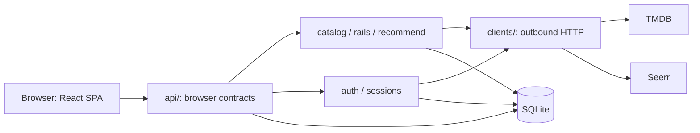

# Architecture

Tasterr is one FastAPI process serving both a compiled React SPA and `/api/v1/*`.
SQLite, in-process caches, and bounded asyncio background work keep deployment to one
container. Running multiple workers is unsupported because rate limits, caches,
single-flight seeding, and background task ownership are process-local.

## Enforced boundaries

- Only `backend/src/tasterr/clients/` imports `httpx` and performs outbound HTTP.
  Client modules own validated base URLs, timeouts, bounded retry where appropriate,
  typed upstream wire models, and secret-bearing headers/cookies.
- Only `backend/src/tasterr/api/` shapes browser responses. Routes use Pydantic input
  and explicit response models rather than forwarding upstream JSON or ORM objects.
- `PublicConfig` is an explicit allowlist projection. TMDB/Seerr keys, the internal
  Seerr URL, Plex tokens, Seerr cookies, and the deployment secret cannot enter it.
- Catalog, rail, and recommendation domain models do not import deployment settings.
  Boundary tests and import-linter contracts enforce these rules.

## Browser and catalog flow

The SPA uses same-origin JSON endpoints through TanStack Query. A home request asks
the rail composer for enabled providers. Catalog services normalize typed TMDB wire
models into secret-free summaries/details; the composer fans out independent reads,
drops failed/thin rails, and de-duplicates titles. Seerr availability is read in
parallel and degrades independently, so it never blocks the TMDB feed.

TMDB and Seerr caches are separate bounded in-process caches with endpoint-specific
TTL/stale windows. A process restart makes them cold but loses no durable state.
TMDB retries only bounded transient failures; Seerr availability uses short timeouts
and no retry storm.

## Identity, sessions, and requests

Local credentials or a Plex token are forwarded directly to Seerr and never stored.
On success, Tasterr upserts the Seerr user and mints a fresh opaque browser session.
Only a SHA-256 hash of the browser token is stored. The browser receives the raw
token once in an HttpOnly, SameSite=Lax cookie, marked Secure when the trusted request
scheme is HTTPS.

The server stores the member's Seerr session cookie for user-attributed requests.
Plex tokens are Fernet-encrypted with `TASTERR_SECRET_KEY`; local passwords are never
retained. A request write sends only the member's Seerr cookie. On Seerr's invalid-
session response, Plex users get one silent re-authentication attempt; local users
are prompted to sign in again. The global Seerr API key is limited to server-side
reads and is never used to forge a member mutation.

Login buckets key by effective client IP after trusted-proxy processing. Ordinary
mutations share a bounded per-user bucket; admin mutations use a separate per-admin
bucket. Every mutation authenticates and passes same-origin validation before it can
spend capacity or change state.

## Learned taste flow

Detail opens and explicit My List/not-interested controls create per-user signals.
Successful Seerr requests create a stronger server-recorded signal. Pure feature,
profile, scoring, decay, and diversity logic sits between API and clients so it is
unit-testable without network mocks. Derived title vectors and user profiles are
rebuildable SQLite caches; raw signals remain the durable source.

After a first login, bounded background work may seed signals from that user's Seerr
request history. Per-user single-flight bookkeeping prevents duplicate seeds. A
failure rolls back/degrades and never prevents ordinary browsing.

## SQLite and process lifecycle

At lifespan startup the process opens one async SQLAlchemy engine, runs Alembic to
head, creates the session factory, and sweeps expired sessions. The database lives at
`DATABASE_PATH`, `/data/tasterr.db` in the production image. Lifespan shutdown closes
the shared HTTP client and disposes the engine.

SQLite is appropriate for one household and one writer process. The named volume is
the only durable container state. Backups must stop the writer (or use SQLite's
backup API), be integrity-checked, and be protected as sensitive household data.

## Frontend contract generation

Backend OpenAPI is generated offline because production does not expose schema/docs
routes. `just types` dumps the schema and runs `openapi-typescript` to produce
`frontend/src/lib/api.gen.ts`. `just check` regenerates to a scratch file and fails
if the committed types drift, so browser contracts are never handwritten twice.

## Degradation and release shape

TMDB failure removes catalog content with a generic error while health remains
available. Seerr unconfigured/down yields Unknown availability and disables or
degrades requests without blanking browse results. Personalization failures omit
personalized rails and preserve generic discovery.

The multi-stage image builds the SPA with the frozen npm lock, installs the backend
with the frozen uv lock, runs as a non-root user, and serves both surfaces. Compose
uses a managed default network for routable LAN Seerr URLs, with an external network
available only through the same-host cross-stack override, and persists only
`/data`. The PR gate runs the ordinary checks, a real-backend Chromium journey, and
a native image/volume smoke; stable tags publish amd64 and arm64 manifests to GHCR.
